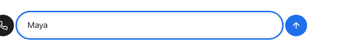
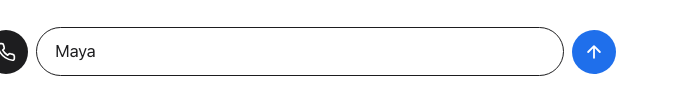

# DESIGN-002 — Design-review gate on the local production build

**Verdict: PASS-WITH-FIXES** (0 × P0, 9 × P1, 8 × P2)

The build matches the DESIGN-001 concept closely. The checklist, bubbles, pills, dark call
device, ring states, Gmail card variants, graduation and welcome-back all read as one text
thread, with no form feel. Every spec state renders at 1440×900 and 390×844 with no
horizontal overflow. On mobile the call panel stays at or below 35% of the viewport (spec
limit is about 40%), so the Gmail card's primary button and the composer stay visible
during a call (`shots/metrics.json`). Nothing I found blocks the demo. The P1 items are
things a Persona reviewer would notice in the first two minutes. Most are one-line CSS or
copy changes.

## How this was run
- Build: `npm -w apps/web run build && npx next start -p 3100` from `apps/web`, with the
  env that `playwright.config.ts` uses: stub agent `e2e/stub-agent.mjs` on :3199, mock
  Google OAuth, and `NEXT_PUBLIC_PERSONA_ICE_URLS=none`. The servers are stopped now.
- `node docs/design/review/tools/shoot.mjs` captures:
  - all 19 `?state=` fixtures (the 16 spec states plus `call-declined`, `call-elsewhere`
    and `gmail-card-partial`) at both viewports;
  - a **live** walk through the real `ApiSessionDriver` against the stub agent
    (`live-*.png`): landing → greeting → "idk" → "Juno" → keep texting → name → privacy
    question → need → graduation → keyboard focus.
- `node docs/design/review/tools/preview.mjs` renders the proposed CSS fixes and the taste
  options by injecting CSS into the running page. No `apps/` files were edited.
- Caveat: the live walk's *agent lines* come from the stub, not the real brain (the stub
  accepts "idk" as a name and echoes "Got it: X."). I judged layout and UI strings from the
  live walk. I judged agent tone against the spec §5 targets in [copy.md](copy.md), not
  against real brain output (`services/**` is out of scope for this packet).

## Issues (ordered by reviewer impact)

| id | state | viewport | sev | screenshot | exact fix | effort |
|---|---|---|---|---|---|---|
| DQ-01 | Gmail card idle/connecting (full variant) | mobile (desktop is tight too) | P1 | [crop](shots/crop-gmail-organize@mobile.png), [desktop](shots/crop-gmail-organize@desktop.png), [fixed](shots/fix-DQ01-gmail-list@mobile.png) | "Organize" runs into its description ("Organizelabels, archive…") because the 64px label column is narrower than the word. `apps/web/app/globals.css:132` → `.gcard li { display: grid; grid-template-columns: 5.5em 1fr; column-gap: 8px; font: var(--t-callout); }` and delete the mobile override at `globals.css:225` (`.gcard li { grid-template-columns: 64px 1fr; }`). | S |
| DQ-02 | Gmail card idle (heads-up note) | both | P1 | [idle](shots/gmail-card-idle@desktop.png) | Two trial facts are missing from the card: only invited accounts can connect, and Google's consent screen may leave the Gmail boxes unticked, which causes a partial grant. `apps/web/components/GmailCard.tsx` `.note` → `<b>Heads up:</b> this is a trial, so Google will say it hasn’t verified the app. Choose <b>Continue</b>, then tick the Gmail boxes (or <b>Select all</b>). Only invited Google accounts can connect for now.` Also change the error card copy (see copy.md U-12). Check this against the real consent screen during INFRA-002. | S |
| DQ-03 | Gmail card idle; graduation | both | P1 | [idle](shots/gmail-card-idle@desktop.png), [home](shots/graduation@desktop.png) | "You can disconnect Gmail anytime in Settings." points to a Settings screen that doesn't exist in this build: home has no Settings entry. A reviewer who looks for it finds nothing. `GmailCard.tsx` last `.fine` line → `You can disconnect Gmail anytime.` Either add a Settings → Disconnect entry on home later, or have Darran update product-facts.md (see OPEN below). | S |
| DQ-04 | chat agent-name (live) | both | P1 | [live](shots/live-2-greeting@desktop.png) vs [fixture](shots/chat-agent-name@desktop.png) | In the live app the agent-name ask has **no suggestion chips**, which fails spec §8 `chat-agent-name`. `ApiSessionDriver` never emits `{kind:"chips"}`, so the chips only exist in fixtures. Fix: the brain includes `suggestions: ["Juno","Atlas","Surprise me"]` on the `transcript` push for the `agent_name` ask, and `lib/session/api-driver.ts` maps it to a `chips` item after that bubble. The chips send text only, so no transition logic moves into the browser. This is the only fix that touches the agent contract. | M |
| DQ-05 | every chat state after typing | both | P1 | [live](shots/live-6-user-name@desktop.png), [crop](shots/crop-composer-focus@desktop.png) | The composer keeps a heavy 3px blue focus ring for the whole conversation (focus stays in the textarea after Enter). It looks like a validation state and fights the calm thread. `globals.css` (after line 62) → `.composer .field:focus-visible { outline: none; border-color: var(--ink); }`. Keep the 3px ring on buttons, chips and cards. **Darran taste question below.** | S |
| DQ-06 | landing | mobile headline, desktop lede | P1 | [mobile](shots/landing@mobile.png), [desktop](shots/landing@desktop.png), fixed: [m](shots/fix-DQ06-landing@mobile.png) / [d](shots/fix-DQ06-landing@desktop.png) | Widows on the first screen: "done." sits alone on mobile and "like." sits alone on desktop. `globals.css:151` add `text-wrap: balance;` to `.landing h1`. `globals.css:152` add `text-wrap: pretty;` and change `max-width: 30ch` → `32ch` on `.landing .lede`. | S |
| DQ-07 | mic denied | both (mobile matters most) | P1 | [mic-denied](shots/mic-denied@mobile.png) | The copy only gives Chrome-desktop steps ("icon at the left of the address bar"), and the colon construction ("I can’t hear you yet: …") sounds robotic. Reviewers will try this on iPhone Safari. `lib/session/api-driver.ts:40-42`: new lines in copy.md U-20..U-22. | S |
| DQ-08 | call in another tab | both | P1 | [crop](shots/crop-call-elsewhere@mobile.png), [desktop](shots/call-elsewhere@desktop.png) | The captions box is empty and the ring is flat, so the panel looks broken, and it's exactly the stress test reviewers will run (two tabs). `lib/session/api-driver.ts:618` → `captions: [{ who: "", tone: "hint", text: "This call is open in another tab. Take it over here, or keep typing." }]`. Mirror the same caption in `fixtures.ts` `call-elsewhere`. | S |
| DQ-09 | Gmail ask (text) | both | P1 | [live](shots/live-7-privacy@desktop.png) | The spec's text Gmail ask says "Tap **Connect** below", but the button says **Continue with Google**. The stub says "the button below". Brain template → "To help with your inbox I’ll need Gmail. Tap Continue with Google below." (copy.md A-12). | S |
| DQ-10 | Gmail error | both | P2 | [error](shots/gmail-card-error@desktop.png) | The card alert and the agent bubble say the same thing ("Google didn't finish…"). Make the bubble shorter: "No luck with Google that time. Try again, or skip for now?" | S |
| DQ-11 | graduation deferred prompts | both | P2 | [home](shots/graduation@desktop.png) | The page talks about the assistant in the third person ("Juno is ready"), but the prompts say "Tell me your name". `lib/session/agent-state.ts:58-60` → "Tell {agent} your name" / "Tell {agent} what to start on". | S |
| DQ-12 | call offer | both | P2 | [offer](shots/call-offer@desktop.png) | The subtitle "A quick call, about two minutes." repeats the landing's whole-onboarding estimate *after* a step is already done. Use "About a minute. Typing works too." | S |
| DQ-13 | partial grant | both | P2 | [partial](shots/gmail-card-partial@desktop.png) | "Allow full access" and "Not you?" are both quiet text buttons stacked, so they read as prose. Make "Allow full access" `btn secondary`. | S |
| DQ-14 | top bar (chat) | desktop | P2 | [topbar](shots/crop-topbar@desktop.png) | The "Setting up" label on the right adds nothing. Drop it, or show the user's name once it's known, like home does. | S |
| DQ-15 | wrong account (fixture) | both | P2 | [wrong](shots/gmail-card-wrong-account@desktop.png) | The fixture's checklist shows `maya@work.co` but the card shows `maya.r@gmail.com`. This is `qa:visual` fixture data only: `fixtures.ts` `gmail-card-wrong-account` account → Maya R. / `maya@work.co`. | S |
| DQ-16 | call declined (fixture) | both | P2 | [declined](shots/call-declined@desktop.png) | The offer card stays fully active after "Keep texting". The live driver drops it once the node moves on, so this is fixture-only. Either dim answered offer cards or drop the card from the fixture. | S |
| DQ-17 | call ended / elsewhere ring | both | P2 | [ended](shots/call-ended@desktop.png) | The flat grey ring on the ended state is fine. Consider 60% opacity on the whole stage so "ended" reads as over at a glance. | S |

Checked with no issue found: fonts (system stack everywhere, no serif or mono), checklist
order and states (including out-of-order fill in `call-connected`), pills and black
primaries, no logo or Band imagery, ringing / muted / reconnecting ring styles, the
"Your progress is saved" badge, mobile call panel ≤ 35% of the viewport, the compact Gmail
card during a call on mobile, the Gmail card's primary action visible during a call, the
welcome-back stamps and offer variant, focus ring on the dismiss ×
([live-9](shots/live-9-focus-ring@desktop.png)), and graduation with no checklist.

## Darran taste question — composer focus (DQ-05)

| A — current: 3px blue ring whenever the textarea has focus | B — proposed: 1px ink border, ring kept for buttons/chips |
|---|---|
|  |  |

The composer holds focus for the whole conversation, so under A the thread always has a
bright blue pill at the bottom. **Recommendation: B.** It's calmer, closer to iMessage, and
still a visible focus indicator (WCAG 2.4.7). Every other control keeps the 3px ring.

## OPEN (for Darran / PM)
- product-facts.md says "Settings → Disconnect", but this build has no Settings surface.
  Either add a minimal disconnect action on home, or change the fact to "ask to disconnect"
  (DQ-03).
- The real brain's greeting and steer-back phrasing weren't exercised here. The stub stands
  in for it. The Monday polish packet should run one `qa:convo` replay and diff the lines
  against copy.md.
