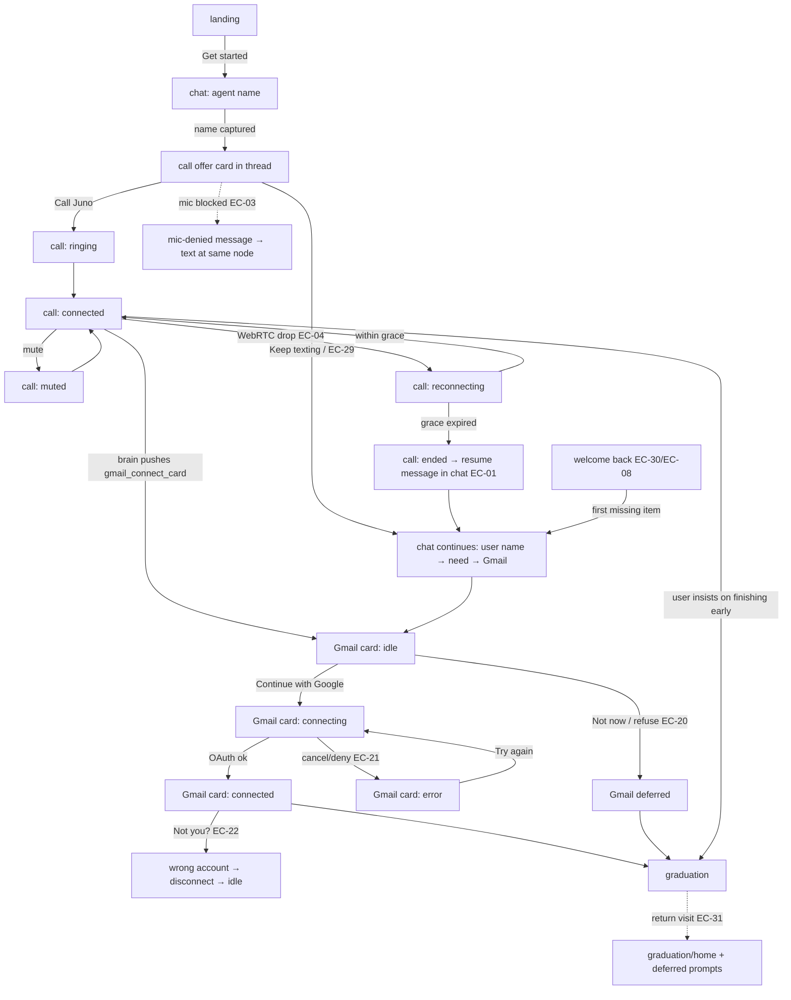

# Onboarding design spec (DESIGN-001)

Status: **ready for FE-001**. Research: [research.md](research.md). Tokens:
[tokens.json](tokens.json) (canonical values; the CSS mirror is `mockups/styles.css :root`).
Mockups: [mockups/index.html](mockups/index.html) opened with `?state=<name>&vp=desktop|mobile`,
rendered to `mockups/<state>@<viewport>.png` by `python3 docs/design/tools/render_mockups.py`.

The mockups use sample content: the assistant is named **Juno**, the user is **Maya**, the
email is `maya.r@gmail.com`, and the need is "inbox triage". FE renders real session values.

---

## 1. Concept

**"The first texts with your new assistant."** Persona's product is a text thread with an
assistant that asks for your OK before acting. The onboarding is that thread: white canvas,
Apple-native type, grey and blue bubbles, black pill buttons. Nothing about it should look
like a form.

**One memorable element: the ring.** Persona's Band has a glowing green ring. Our voice
indicator is a CSS ring (no photo, no logo) that shows the call's state: halo pulse while
ringing, glowing while the agent speaks, grey when muted, dashed amber when reconnecting,
faded when ended. It also shows up on the landing page and on the call-offer card, so it
introduces the call before the call happens. Everything else stays quiet.

**Principles**
1. **Conversation first.** Every request is a message from the assistant. Cards (call
   offer, Gmail) come from the assistant inside the thread, not as modals.
2. **Progress is implicit.** A 4-item checklist in the top bar fills whenever a slot is
   captured, in any order. There's no stepper, no "Step 2 of 4", and no field labels in the
   thread.
3. **The call reads as a call.** A dark, device-shaped panel with a name, a timer, the ring,
   live captions and round call controls. It is visually a different object from the chat.
4. **Consent in their words.** "Nothing is sent or changed without your OK."
5. **The browser only renders.** Every state shown here comes from brain pushes
   (`transcript`, `state`, `gmail_connect_card`, `call_state`, `graduate`, per
   ARCHITECTURE §6). The UI never decides what comes next.

## 2. Flow

The checklist order is **Assistant name → Your name → What you need → Gmail**. That's the
display order only. Items fill in whatever order the brain fills them (see
`call-connected`, where "What you need" is filled before "Your name").

## 3. Foundations

### 3.1 Layout grid

| | Desktop (≥768px; reference 1440×900) | Mobile (≤767px; reference 390×844) |
|---|---|---|
| Top bar | 64px, 32px side padding. Wordmark left, checklist centred, status text right | 56px top bar, then the checklist as its own 40px row |
| Chat column | centred, max 680px, 24px side padding | full width, 16px side padding |
| Call | right rail 440px, `mist` background, 1px `line` left border, device centred (360×740, max-height `100vh − 112px`) | full-bleed dark panel **above** the chat (stacked), ≈ 300px tall. Name + timer row with a 44px ring at the right, captions, then controls |
| Gmail card | in the thread, max 440px, left-aligned like an agent message | full width in the thread; **compact** variant while a call is active |
| Home / graduation | single column, max 760px | 16px side padding |

Before a call, desktop shows the chat column alone, centred. The rail appears when
`call_state` becomes `ringing` and stays through `ended` until the user keeps typing. The
chat never moves under the call; the rail simply takes 440px from the right.

Alignment: chat is left/right by speaker. Headlines on landing and home are left-aligned.
Only the call panel's name, timer and ring are centred (desktop).

### 3.2 Type

There's one family: the system stack (`-apple-system, BlinkMacSystemFont, "SF Pro Text",
"SF Pro Display", Inter, ...`). That matches Persona's own site. Inter is the non-Apple
fallback, and FE may self-host Inter.

| Token | Size/line-height | Weight | Use |
|---|---|---|---|
| display | 56/1.02, tracking −0.035em (mobile 40) | 600 | landing headline |
| home-title | 40/1.1, −0.03em (mobile 30) | 600 | graduation headline |
| call-name | 30/1.1, −0.02em (mobile 22) | 600 | name in the call panel |
| title | 28/1.15 | 600 | reserved |
| heading | 20/1.25 | 600 | card titles ("Connect Gmail") |
| body | 17/1.45 | 400 | chat bubbles, composer |
| body-strong | 17/1.45 | 600 | offer title, emphasis |
| callout | 15/1.4 | 400 | card body, captions, secondary copy |
| caption | 13/1.3 | 500 | timestamps, checklist labels, control labels |

Use sentence case everywhere. No all-caps labels and no italic single-word accents. Use
tabular numbers for the call timer.

### 3.3 Color

All values are in `tokens.json → color`. Roles:
- `ink` `#1D1D1F` is text. `ink-2` `#6E6E73` is secondary text. `ink-3` `#76767C` is for
  tertiary text, placeholders and stamps, **on paper only**.
- `paper` `#FFFFFF` is the canvas. `mist` `#F5F5F7` is used for panels, tiles and the call
  rail. `line` `#E3E3E8` is for borders.
- `bubble-agent` `#EDEDF0` (ink text) and `bubble-user` `#1F6FEB` (white text). The blue is
  our own; don't use iMessage blue.
- `signal` `#30D158` is the ring and the checklist fill. `signal-ink` `#1A7F37` is for
  green text. `signal-wash` is the "just filled" highlight.
- `amber` / `amber-ink` / `amber-wash` mark reconnecting and deferred items.
- `danger` `#E5484D` is the End-call button. `danger-ink` / `danger-wash` are for error text
  and alert fills.
- `call-top → call-bottom` is the graphite gradient of the call surface. `call-ink` and
  `call-ink-2` are text on it.
- `focus` `#1F6FEB` is the focus ring.

Measured contrast (WCAG): ink/paper 16.8; ink-2/paper 5.07; ink-2/mist 4.66; ink-3/paper
4.51; white/bubble-user 4.63; call-ink-2/call-top 5.36; amber/call-top 7.5;
danger-ink/danger-wash 5.76; amber-ink/amber-wash 5.8; signal-ink/signal-wash 4.66.
Graphical: signal/call-top 6.8; white icon/danger 3.9 (≥3:1).

### 3.4 Spacing, radii, shadows

- Spacing uses a 4-based scale: 4, 8, 12, 16, 24, 32, 48, 64 (`s1`–`s8`).
- The gap between bubbles is 8px. Stamps get 12px above.
- Card padding is 24px (16px on mobile).
- Radii:
  - bubble 20, with a 6px corner on the speaker's side at the bottom
  - card 20, tile 14, device 44
  - pill 999 for all buttons, chips and the composer
- Shadows only go on floating objects:
  - `shadow.card` for the in-thread offer and Gmail cards
  - `shadow.device` for the desktop call device
  - tiles and bubbles get none
- Minimum hit target is 44×44. Call controls are 64px (52px on mobile).

### 3.5 Motion

Tokens are in `tokens.json → motion`.
- New messages: fade and rise 6px over 200ms.
- Cards: fade and scale from .98 over 320ms.
- Checklist fill: the bar grows over 320ms and the item gets a `signal-wash` background for
  1.6s.
- Ring:
  - ringing: halo pulse, 1.6s
  - speaking: glow follows the agent's audio level (120ms smoothing)
  - reconnecting: dashed border rotates, 2.4s linear
  - other states: static
- The typing indicator is three dots.
- Nothing else animates on its own, and there are no hover animations.
- `prefers-reduced-motion`: everything is instant, and the ring changes state with color and
  opacity only.

## 4. Components and states

### 4.1 Top bar and checklist (`state` push)

- There are 4 items: **Assistant name**, **Your name**, **What you need**, **Gmail**. On
  mobile the labels shorten to Assistant, You, Need, Gmail and the values are hidden.
- Each item shows a 14px dot, the label, the value (desktop) and a 2px bar.
- Item states:
  - **empty**: hollow grey dot, value "Not yet", grey bar.
  - **filled**: green dot with a check, ink value (e.g. "Juno", "maya.r@gmail.com"),
    green bar. It highlights with `signal-wash` for 1.6s when it has just filled.
  - **deferred** (after skipping or graduating without it): dashed amber dot, value "Later"
    in `amber-ink`.
- Spoken or typed Gmail (`candidate`) stays **empty**. Gmail is filled only after OAuth.
- The checklist is not interactive. It's an `aria-label="Setup progress"` list, and each
  item's accessible name is "<label>: <value>".
- Right side of the top bar: "Setting up" during onboarding, the user's name after
  graduation.

### 4.2 Chat thread and composer (`transcript` push)

- **Agent bubble**: `bubble-agent`, left. **User bubble**: `bubble-user`, right. Max width is
  76% (84% on mobile).
- **Voice turns** are mirrored into the thread (same bubbles, same `body` size) so the chat
  stays the single transcript. Every bubble variant (agent, user, voice transcript, resume,
  name read-back) uses the one `body` token (17/1.45); e2e asserts equal computed font-size.
- Stamps ("Today 9:41 AM") show at session start and after gaps of 30 minutes or more.
- Dividers ("Call started · 9:43 AM", "Call ended · 1:36") mark the call boundaries.
- Quick-reply chips are optional suggestions under an agent message (e.g. Juno, Atlas,
  Surprise me). Tapping one sends it as the user's message.
- Typing indicator: three dots in an agent bubble.
- **Composer**: a pill field and a round blue send button (44px). A black round call button
  on the left appears once the call is available (after the agent name) and there's no live
  call. Placeholders change with context:
  - "Type a name…" at the agent-name node
  - "Message Juno…" in text mode
  - "Type instead of talking…" during a call
  - "Type while we reconnect…" while reconnecting
- The thread is a `role="log"` with `aria-live="polite"`.

### 4.3 Call offer card

This is an in-thread card from the agent.
- Contents: a 56px ring, the title "Talk it through with Juno", the subtitle "A quick call,
  about two minutes.", and two buttons: **Call Juno** (primary, phone icon) and **Keep
  texting** (secondary).
- Declining (EC-29) removes nothing. The call button stays in the composer.
- The welcome-back variant uses the title "Finish on a quick call" and the secondary button
  "Connect Gmail here" (or whatever the first missing item is).

### 4.4 Phone simulator (`call_state` push)

**Layout, top to bottom:**
- the name (Juno)
- status: "Calling…", the timer "0:42", "Reconnecting…" or "Call ended · 1:36"
- an optional badge pill
- the ring (124px desktop, 44px mobile); the "You're muted" badge overlays it without moving the ring or captions
- the **Live captions** panel
- the controls row

| State | Status line | Ring | Badge | Controls |
|---|---|---|---|---|
| ringing | "Calling…" | `ringing` halo pulse | — | Mute (disabled), Type instead, **Cancel** (red) |
| connected | timer | `speaking` when the agent talks, `listening` otherwise | — | Mute, Type instead, End |
| muted | timer | `muted` grey | "You're muted" | **Unmute** (inverted white), Type instead, End |
| reconnecting | "Reconnecting…" (amber), timer paused | `reconnecting` dashed amber | "Your progress is saved" | Mute, Type instead, End |
| ended | "Call ended · m:ss" | `ended` faded | — | **Call again** (green), Keep typing |

**Live captions** are always visible on every call state.
- They show the last 2–3 turns (1–2 on mobile), each prefixed with **You** or **Juno** in
  bold.
- The in-progress line is white with a green caret. Earlier lines are `call-ink-2`.
- It's `aria-live="polite"`. Before the agent answers, the panel shows "Captions appear here
  when Juno answers."
- On reconnecting it adds an amber line: "The line dropped. Trying to reconnect."

**Type instead** focuses the composer and doesn't end the call. The user can type during a
call, and typed turns join the same brain.

**Call already in progress elsewhere (EC-02):** the rail shows the ended-style device with
the status "On a call in another tab" and the buttons **Take over here** and **Keep
typing**. There's no mockup for this; build it from the ended-state visuals.

### 4.5 Gmail connect card (`gmail_connect_card` push)

The card is placed in the thread as an agent message. **During a call it never overlays the
call panel.** On desktop it's in the chat column, next to the rail. On mobile the call panel
stays pinned above the thread and the card appears in the thread below it (compact variant).

| State | Content |
|---|---|
| **idle** | Mail glyph. Title "Connect Gmail", subtitle "So Juno can work in your inbox". Scope list: **Read**: to see what needs your attention. **Organize**: labels, archive, mark as read, drafts. **Send**: only after you say OK. Body: "Nothing is sent or changed without your OK. You sign in on Google, so Juno never sees your password." Mist note: "**Heads up:** this is a trial, so Google will say it hasn't verified the app. Choose **Continue** to go on." Actions: **Continue with Google** (primary), **Not now** (quiet). Fine print: "You can disconnect Gmail anytime in Settings." |
| idle, compact (mobile in call) | The same card, but the scope list and password line are replaced by one sentence: "Juno will read, organize, draft, and send email for you. Nothing is sent or changed without your OK." The heads-up and actions stay. |
| **connecting** | The primary button becomes a spinner with "Waiting for Google…" (`aria-busy`), plus a quiet "Open the Google window again" (for when a popup was blocked). On a call, the agent says it'll hang on. |
| **connected** | Green check glyph, title "Gmail connected", an account row with avatar initials, the **name**, and the **address**. Quiet action: "Not you? Use a different account". The call hears "Got it, connected as …". |
| **error** (EC-21) | Alert glyph, title "Gmail isn't connected yet", a `role="alert"` box: "Google didn't finish signing in. The window may have closed, or access wasn't allowed." Help: "Try again and choose **Continue** on the "unverified app" screen, then **Allow**." Actions: **Try again**, **Skip for now**. |
| **wrong account** (EC-22) | The connected card with the account row, plus "Wrong account? Disconnect it and pick another one on Google." Actions: **Use a different account** (disconnect, then re-run OAuth), **Keep this one**. The Gmail checklist item shows the connected address until the user disconnects. |

Button naming stays consistent: "Continue with Google" / "Waiting for Google…" / "Gmail
connected". FE should use Google's official sign-in button assets if Google's branding
rules require them (open question). The mockup uses a plain primary pill.

### 4.6 Graduation / home (`graduate` push)

- Headline "You're all set, Maya." with the lede "Juno is ready. Here's what it knows so
  far."
- A wide white tile: "You asked for help with" (HONEST-001: no capability claim) plus a summary of the **need**, and a line
  about the first thing Juno will do (the brain writes this; it restates the user's need
  and makes no new product claims). Then two mist tiles: **Your assistant** and **You**.
- **Deferred prompts**:
  - one amber-wash card per missing item (dashed amber border)
  - contents: glyph, title ("Connect Gmail when you're ready"), a one-line reason, a
    primary action, and an **×** dismiss button (`aria-label="Dismiss"`)
  - dismissing only hides the prompt for this visit
  - on mobile the button wraps under the text
- A composer ("Message Juno…") stays at the bottom. The conversation continues after
  graduation.
- The same surface is used when returning after graduating (EC-31).

### 4.7 Welcome back (EC-30, EC-08)

- The thread is restored from the server. Previous messages stay visible under their
  original stamps, and a new stamp ("Today 8:15 AM") is added.
- The agent greets the user **by name** and names only what's left: "Welcome back, Maya!
  We're nearly done. Just Gmail left, so I can start on that inbox."
- It follows with the offer card variant.
- The checklist already shows the filled items. Nothing that's filled is asked again.
- EC-08 (refresh) shows the same restored thread **without** a new greeting.

### 4.8 Mic denied (EC-03)

This is an agent message in text, not an error modal:

> I can't hear you yet: your browser blocked the microphone. To allow it, click the icon at
> the left of the address bar, set Microphone to Allow, then call again.

It's followed by the question for the current node ("Or we can just keep texting. So, what
should I call you?"). The rail doesn't open.

## 5. Copy tone guide

The voice is Persona's: friendly, brief and confident, a capable friend over text.
- Use contractions and plain verbs. Keep one idea per bubble and at most two bubbles per
  turn.
- Don't use exclamation marks after the greeting, and no emoji.
- Never "Step 2", "Please enter", "Invalid input", or "Oops".
- Consent vocabulary: "your OK". Never promise security properties that aren't in
  `docs/product-facts.md`.
- The assistant speaks as itself ("I") once named. Before naming it says "your new
  assistant".
- Errors say what happened and what to do, in the interface's voice, without apologizing.

| Node / moment | Sample line(s) |
|---|---|
| greeting | "Hi! I'm your new assistant. I'll help with email, your calendar, and the everyday stuff." / "First things first: what would you like to call me?" |
| agent name captured | "Juno it is. I like it." |
| agent name steer-back ("idk", nonsense) | "No pressure. Pick anything, or I can suggest one. Juno? Atlas?" |
| agent name refusal ("just call you assistant") | "Assistant works. You can rename me anytime." (fills with default; flow continues) |
| call offer | "The rest is easier out loud. Want to hop on a quick call? Or we can keep texting, totally fine either way." |
| call declined | "Texting it is. What should I call you?" |
| call answer | "Hey, it's Juno! What should I call you?" |
| user name | "Nice to meet you, Maya." |
| user name refusal | "Totally fine, I'll just say hi. So what could I take off your plate?" |
| need | "What's one thing you'd love help with? Email, scheduling, errands, anything." |
| need captured out of order | "Got it, inbox rescue is on the list. And your name?" |
| need steer-back (off-topic / joke) | "Ha, fair. Really though, what's one thing that'd make this week easier?" |
| Gmail ask | "To help with your inbox I'll need Gmail. I just put a button on your screen." (text: "…Tap Connect below.") |
| Gmail value (after one refusal) | "Fair. It's how I read and sort your email, and I never send anything without your OK. Want to connect now or later?" |
| Gmail second refusal | "No problem. I'll leave a reminder for later." (graduates with Gmail deferred) |
| Gmail waiting (call) | "Take your time. I'll hang on while you sign in with Google." |
| Gmail connected | "Got it, connected as maya.r@gmail.com." (voice spells the domain) |
| Gmail failed | "Looks like Google didn't finish. Want to try again, or skip it for now? You can always connect later." |
| reconnect within grace | "Sorry, we got cut off. You were telling me about your inbox." |
| hangup resume (chat) | "We got cut off, no worries. I still have your name and what you need. Only Gmail is left. Call back, or connect it right here?" |
| insists on finishing early | "Sure, we can wrap up. I'll keep what I have and remind you about the rest." |
| graduation | "You're all set, Maya." |
| welcome back | "Welcome back, Maya! We're nearly done. Just Gmail left, so I can start on that inbox." |
| silence on call (floor) | "Still there? Take your time. You can also type if that's easier." |

## 6. Accessibility

- **Focus**: 3px `focus` outline with a 2px offset on every interactive element
  (`:focus-visible`). Tab order: top bar → thread cards (in DOM order) → composer → call
  controls.
- **Contrast**: all text pairs meet ≥ 4.5:1 (§3.3). `ink-3` is only allowed on white.
- **Captions**: the Live captions panel is always rendered while the rail is open, is
  `aria-live="polite"`, and is mirrored into the thread. Never gate captions behind a toggle.
- **Screen readers**:
  - Call status changes (ringing / connected / reconnecting / ended) are announced
    through a visually hidden `role="status"` in the rail.
  - Checklist items have accessible names such as "Gmail: Not yet".
  - The Gmail error box is `role="alert"`.
  - Every icon-only button has an `aria-label`.
- **Controls**: call controls are real `<button>`s with visible text labels. The mute button
  uses `aria-pressed`. End and Cancel are red **and** labelled, so color isn't the only cue.
- **Reduced motion**: §3.5.
- **Keyboard**: Enter sends and Shift+Enter adds a new line. Escape in the composer does
  nothing (it never ends a call).

## 7. Responsive rules

- At ≤767px:
  - the rail stacks above the chat
  - the checklist moves to its own row with short labels
  - bubbles widen to 84%
  - the Gmail card goes full width and compact during a call
  - the landing art moves above the copy
  - home tiles go 2-up, with the wide tile full width
- The call panel on mobile is never taller than ~40% of the viewport, so the thread and
  composer stay visible and the Gmail card can appear without covering controls.
- Ending a call on mobile collapses the panel to the ended state. "Keep typing" removes it.
- The composer stays pinned to the bottom (respect `env(safe-area-inset-bottom)`).
- The layout must work from 360px to 1920px wide. The chat column never exceeds 680px.

## 8. Acceptance checklist (verifiable from screenshots alone)

Compare app screenshots (`npm run qa:visual`, 1440×900 and 390×844) with
`docs/design/mockups/<state>@<viewport>.png`.

**Global**
- [ ] A1 The white canvas, `#1D1D1F` text and system-font type match the mockups; no serif or monospace faces.
- [ ] A2 No stepper, "Step n of 4", or form-field labels anywhere. Progress shows only as the 4-item checklist.
- [ ] A3 The checklist shows Assistant name, Your name, What you need, Gmail in that order, and each item is visibly empty (hollow dot, "Not yet"), filled (green dot, value, green bar), or deferred (amber dashed dot, "Later").
- [ ] A4 All buttons are pills; primary is black with white text.
- [ ] A5 No Persona logo glyph, Band photo, or third-party imagery appears. The wordmark is plain text.

**Per state**
- [ ] `landing`: headline, one "Get started" primary button, a time estimate line, and the green ring art. No checklist.
- [ ] `chat-agent-name`: all checklist items empty; greeting plus name question as agent bubbles; suggestion chips; composer placeholder "Type a name…"; no call button yet.
- [ ] `call-offer`: Assistant name filled with "Juno" (highlighted); offer card with ring, "Call Juno" and "Keep texting"; call button in the composer.
- [ ] `call-ringing`: dark call panel beside the chat (desktop) or above it (mobile); "Calling…"; captions panel visible with placeholder; Mute disabled; red Cancel.
- [ ] `call-connected`: timer; glowing ring; captions show **You** and **Juno** lines with the live caret; "What you need" filled while "Your name" is still empty (out-of-order fill); voice turns mirrored in the thread.
- [ ] `call-reconnecting`: amber "Reconnecting…", dashed amber ring, "Your progress is saved" badge, amber caption line; composer still usable.
- [ ] `gmail-card-idle`: Gmail card in the thread while the call panel and all three controls stay fully visible; card shows Read/Organize/Send (desktop) or the one-sentence summary (mobile), the "your OK" line, the unverified-app heads-up, "Continue with Google" and "Not now".
- [ ] `gmail-card-connected`: card shows the connected name and address and a "Not you?" action; Gmail checklist item filled with the address; the caption confirms the address.
- [ ] `gmail-card-error`: red alert box explaining what happened, "Try again" and "Skip for now"; Gmail item still empty.
- [ ] `graduation`: "You're all set, <name>."; need summary tile; assistant and user tiles; amber deferred Gmail prompt with Connect and a visible × dismiss; composer present; no checklist.
- [ ] `welcome-back`: earlier messages visible under an older stamp plus a new stamp; greeting by name naming only what's left; 3 of 4 items filled; offer card variant.

**Extra states rendered for FE** (not in the qa:visual gate): `call-muted`, `call-ended`,
`gmail-card-connecting`, `gmail-card-wrong-account`, `mic-denied`.

**Checks that need more than screenshots** (FE tests): focus ring visible when tabbing,
reduced-motion honoured, `aria-live` on captions and thread, `role="alert"` on the Gmail
error.

## 9. Files

- `mockups/index.html`, `mockups/styles.css`: the static mockup source (all states, both
  viewports).
- `mockups/<state>@desktop.png`, `mockups/<state>@mobile.png`: 11 required states plus 5
  extras.
- `tools/render_mockups.py`: re-renders the PNGs. `tools/capture_refs.py`: re-captures the
  references.
- `references/`: third-party screenshots, for analysis only. They never ship and are never
  copied into `apps/`.
